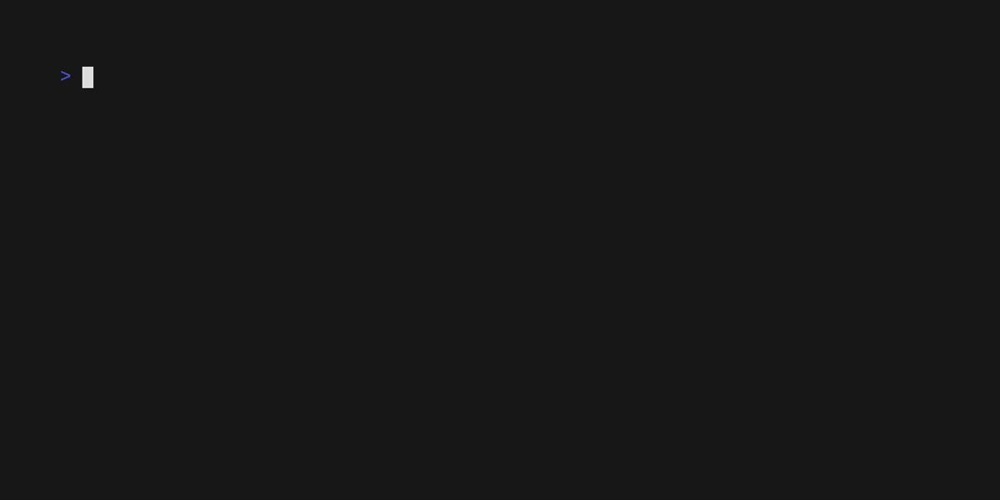

# Intro

Bubbleprompt is a framework for creating interactive terminal prompts.
Bubbleprompt is designed to be ran as a [Bubbletea](https://github.com/charmbracelet/bubbletea) [model](https://github.com/charmbracelet/bubbletea/tree/master/tutorials/basics#the-model).
If you're not familiar with Bubbletea, please familiarize yourself with it before attempting to use Bubbleprompt.



## Installation

```bash
go get github.com/aschey/bubbleprompt@main
```

## Concepts

Bubbleprompt consists of three distinct components, the **editor**, **input handler**, and **renderer**. Each plays a different part in the application's lifecycle.

### Editor

An **editor** component is a single line text input that receives user input and displays it on the screen.
It is defined by the [Editor](https://github.com/aschey/bubbleprompt/blob/main/editor/editor.go) interface.
Bubbleprompt provides four types of editors out of the box:

- **Simple** - basic editor designed to require little configuration.
  It works well when you don't need any kind of custom syntax highlighting or complex behavior like cli-style flags.
- **Command** - batteries-included editor for parsing standard Unix-style command line syntax. Includes extra features like placeholders.
- **Lexer** - base token-based editor so you can supply your own custom lexer and optionally a formatter for syntax highlighting
- **Parser** - a small layer on top of the lexer editor to additonally run the tokens through a parser

### Input Handler

An **input handler** is a struct that fulfills the [InputHandler](https://github.com/aschey/bubbleprompt/blob/main/prompt/InputHandler.go) interface.
It consists of three methods:

- **Complete** - This method is responsible for generating the list of suggestions that appear beneath the editor.
  It is automatically invoked whenever bubbleprompt receives user input or it is explicitly requested.
- **Execute** - This method is executed whenever the user presses enter.
  It should parse the text that the user entered and return a [Bubbletea model](https://github.com/charmbracelet/bubbletea/tree/master/tutorials/basics#the-model).
  Bubbleprompt will then pause and allow the new model to take over the event loop until it returns `tea.Quit`.
- **Update** - This is the standard update method used in the standard Bubbletea event loop.

### Renderer

A **renderer** is responsible for taking all output generated by Bubbleprompt and returning the final output that will be rendered by Bubbletea.
It is defined by the [Renderer](https://github.com/aschey/bubbleprompt/blob/main/renderer/renderer.go) interface.
Bubbleprompt provies two renderers that you can choose from:

- **Unmanaged (default)** - This renderer prints output to the screen without doing anything to manage the viewport.
  Every new entry will be appended to the terminal history just like a normal CLI.
- **Viewport** - This renders the entire program inside a viewport so that you can control the width and height.
  This is useful if you want to run Bubbleprompt alongside other Bubbletea widgets or if you want to control the scrolling behavior.
